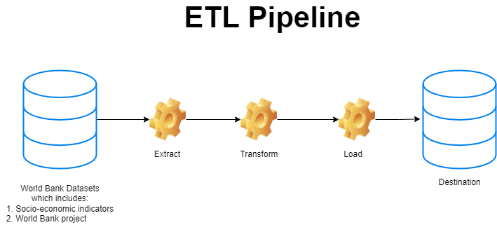

# ETL_pipeline

In this project, I have worked on hand-coding the ETL pipeline for the World Bank datasets. My goal is to combine the extracted datasets, clean it, load it to the data warehouse where it can be used for Machine learning model to predict the World bank Project cost
